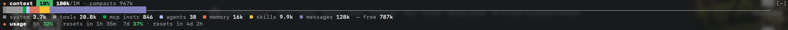

# claude-mods

Mods for [Claude Code](https://code.claude.com): plugins with a hooks module that change what Claude Code does and draw their own UI. This repository is a plugin marketplace, so you can add it once and install the mods you want.

| Mod | What it does |
| --- | --- |
| [`context-bar`](context-bar/) | A bar above the prompt that breaks the context window down by category, like a live `/context`, with your plan's usage limits below it. Toggle it with `/context-bar`. |
| [`done-sound`](done-sound/) | Plays a macOS system sound when Claude finishes a reply, and a different one when a turn ends on an error. Mute it with `/sound off`. |



## Requirements

- Claude Code 2.1.287 or later, where mods load by default. Both mods were built and tested on 2.1.288.
- `done-sound` needs macOS, because it plays sounds with `afplay`.

## Install

Add this repository as a marketplace, then install the mods you want:

```bash
claude plugin marketplace add myUdav4iik/claude-mods
claude plugin install context-bar@claude-mods --scope user
claude plugin install done-sound@claude-mods --scope user
```

Installed plugins load when a session starts, so start a new session (or restart a running one) to see them.

To try a mod for a single session without installing it, clone the repository and point Claude Code at the mod's folder:

```bash
git clone https://github.com/myUdav4iik/claude-mods.git
claude --plugin-dir ./claude-mods/context-bar
```

## Update

```bash
claude plugin marketplace update claude-mods
claude plugin update context-bar@claude-mods
claude plugin update done-sound@claude-mods
```

An update is only picked up when the mod's `version` in its `.claude-plugin/plugin.json` has changed.

## Uninstall

```bash
claude plugin uninstall context-bar@claude-mods --scope user
claude plugin uninstall done-sound@claude-mods --scope user
claude plugin marketplace remove claude-mods
```

## Repository layout

```
.claude-plugin/marketplace.json   the marketplace: lists the mods below
context-bar/                      one folder per mod, each a complete plugin
  .claude-plugin/plugin.json      name, version, description
  hooks/hooks.json                points at the hooks module
  hooks/register.tsx              the mod itself
  types/index.d.ts                the mod's $.state contract
  tests/                          tests run by `claude plugin test`
done-sound/
  ...
```

## Development

Each mod exports `register(on, options)` from its hooks module and adds hooks with `on(event, hook)`. The API is early access and changes between Claude Code releases; the type declarations Claude Code generates for your build are the reference.

- **Type definitions.** Claude Code writes the API's type definitions into each mod's `.claude-plugin/types/` folder. That folder is ignored by git; each mod's `tsconfig.json` points at it, so editors type-check the mod once it exists.
- **Check a mod** before loading it. `validate` reports what the module hooks and calls and anything Claude Code would refuse:

  ```bash
  claude plugin validate ./context-bar
  ```

- **Run its tests** against the engine itself. `context-bar`'s tests draw the bar on the terminal and desktop surfaces and fail if either surface refuses the drawing:

  ```bash
  cd context-bar && claude plugin test .
  ```

- **Try changes live.** Start Claude Code with `--plugin-dir` pointing at a mod's folder; an interactive session reloads the mod when its files change.
