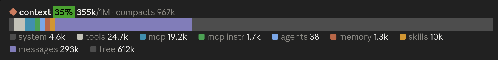

# context-bar

A live breakdown of the context window, drawn in the band above Claude Code's prompt.

In the terminal:


In the desktop app:



- **Header:** the share of the window in use, as a badge that is green under 50%, yellow under 80% and red above. Then the tokens in use, the window size, and the point where auto-compaction runs.
- **Bar:** one segment per category, in proportion to its share of the window, followed by a track for the free space.
- **Legend:** each category with its token count, in the colours `/context` uses.
- **Usage:** your plan's rate-limit windows (`5h`, `7d`, or a gateway's `spend` limit), each with the share used, coloured like the context badge, and a countdown to when it resets. The row only appears on a subscription, where Claude Code receives these figures.

## Usage

| Command | Does |
| --- | --- |
| `/context-bar` | Shows or hides the bar |
| `/context-bar on` | Shows the bar |
| `/context-bar off` | Hides the bar |

The command runs at once, even while Claude is working. The choice is remembered across sessions. Claude Code's own `[-]` control on the band collapses it as well.

## How it works

| Hook | What it does |
| --- | --- |
| `session.start` | Registers `/context-bar`, restores the saved on/off choice, takes a first reading, and starts a once-a-minute timer for the reset countdowns. |
| `turn.complete` | Takes a reading after each turn of the main conversation. Subagent turns are skipped. |
| `session.compact` | Takes a reading after the conversation is compacted. |
| `session.measure` | Updates the usage row when a rate-limit window moves, between turns too. |
| `ui.render` on `AbovePrompt` | Draws the band. It steps aside while Claude Code shows a survey there. |

Readings come from `$.session.usage({ breakdown: 'summary' })`, the same per-category breakdown `/context` shows. The `summary` mode estimates locally, so a reading sends no requests and costs nothing. The same call returns the rate-limit windows from the last API response; the usage row shows those, so it sends no requests either.

The bar is built from flex boxes, each growing by its share of the window, so it splits in exact proportion at any width and never wraps. Small categories still get at least one cell. Free space is drawn differently per surface:

- **Terminal:** a dim line, because Claude Code's colour for free space there is bright enough to read as used.
- **Desktop app:** a dark fill. The desktop wraps long runs of text rather than clipping them, so a line of characters doesn't work there.

The compaction reserve is drawn as part of the free track; the header shows where compaction runs.

## Limitations

- **Estimates:** the category figures are estimates, as in `/context`, so the total can differ slightly from the status line.
- **Once per turn:** the bar updates after each turn, not while Claude is working.
- **Usage after a reset:** the percentages come from the last API response. Once a window's reset time passes, the row shows "resetting" until the next response brings a new figure.
- **Before the first reply:** the bar shows "waiting for the first reading…".
- **Shared band:** the band above the prompt holds one mod at a time. If another installed mod draws there, only one of them shows.

## Tests

`tests/bar.test.tsx` feeds the mod a sample breakdown, draws the band on the terminal and desktop surfaces, and fails if either surface refuses the drawing. Claude Code drops a drawing it can't validate without an error you'd see, so run the tests after changing how the bar is drawn:

```bash
claude plugin test .
```
